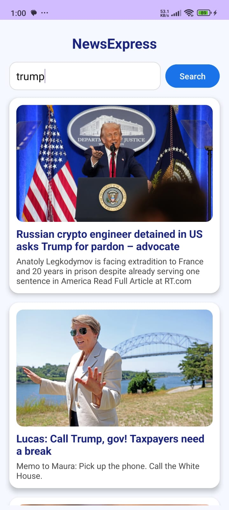

# 🗞️ Kotlin News App

A modern and responsive **Android News App** built using **Kotlin**, **Retrofit**, and **NewsAPI**.  
Search for news articles in real-time, view headlines, descriptions, and images — and tap to read full articles in your browser!

---

## 📱 Features

- 🔍 Search for news articles using keywords  
- 📰 Real-time news data using [NewsAPI.org](https://newsapi.org/)
- 🧩 Dynamic list of articles using RecyclerView
- 🖼️ Image previews using Glide
- 🎨 Clean card-based UI with Material Design
- ⚡ Fast loading with Retrofit and ViewBinding
- 🌐 **Open full article in browser** on item click

---

## 🚀 Tech Stack

- **Kotlin**
- **Retrofit** – HTTP networking
- **NewsAPI** – News data provider
- **RecyclerView** – Displaying dynamic lists
- **Glide** – Image loading
- **ViewBinding** – Safer UI access
- **CardView** – Clean material UI

---

## 📸 Screenshots

> Add your actual screenshots in a folder named `screenshots/` and update the file names below:

| Home Screen | Search Results | | Clicked After|
|-------------|----------------| |--------------|
|  |  | | 

